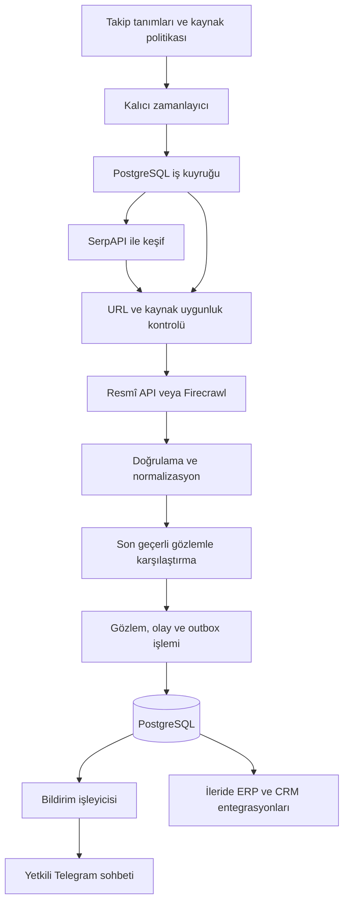

# Web veri toplama ve Telegram otomasyonu — teknik yol haritası

Tarih: 24 Eylül 2026. Durum: önerilen mimari; henüz uygulama geliştirilmedi.

> Güncelleme: Son tarif sabit siteler ve Google sorgularıyla farklı bilgi türlerini keşfedip yerel/API LLM ile analiz ederek Telegram'a aktaran servistir. Web ertelendi. Güncel kapsam için [Teknik görev dokümanını](docs/TEKNIK_GOREV_DOKUMANI.md) kullanın. Bu belge ilk ürün/fiyat örneğiyle tarihsel referanstır. Paket [README](README.md) içindedir.

## 1. İlk teslimat ve kapsam

İlk hedef: izin verilen bir ürün kaynağındaki fiyat/stok bilgisini düzenli kontrol etmek, doğrulanmış değişikliği kaydetmek ve yetkili Telegram sohbetine bildirmek.

Başlangıç varsayımları: tek işletme, tek dağıtım, sınırlı kaynak listesi, dakikalar/saatler ölçeğinde kontrol. Trafik ve bütçe ölçüldükçe genişletilecek. İlk sürümde yönetim için yapılandırma dosyası ve sınırlı Telegram komutları yeterli; web paneli sonraya bırakılabilir.

Bildirim gerçek zaman garantisi taşımaz. Gecikme; kontrol aralığı, kaynak/API önbelleği, iş kuyruğu ve sağlayıcı yanıt sürelerinden oluşur. Örneğin 15 dakikalık kontrol, değişikliğin aynı anda fark edilmesini garanti etmez.

## 2. Hangi teknoloji ne işe yarayacak?

| Bileşen | Öneri | Sorumluluk / başlama zamanı |
|---|---|---|
| Ana uygulama | Rust | İş kuralları, servisler, veri modeli; başlangıç |
| Asenkron çalışma | Tokio | Ağ istekleri, zamanlayıcı ve sınırlı eşzamanlı işleme; başlangıç |
| HTTP entegrasyonları | reqwest + serde | API çağrıları ve tipli JSON dönüşümü; başlangıç |
| Kalıcı veri | PostgreSQL + SQLx | Takipler, gözlemler, işler, olaylar ve bildirim kuyruğu; başlangıç |
| Arama/keşif | SerpAPI | İzinli sorgulardan aday URL bulma; temel takip çalıştıktan sonra |
| İçerik toplama | Önce kaynak resmî API'si, gerektiğinde Firecrawl | Sayfayı işlenebilir içeriğe çevirme; kaynak adaptörü içinde |
| Bildirim | Telegram Bot API | Yetkili hedeflere mesaj, sınırlı yönetim komutları; başlangıç |
| Yönetim HTTP katmanı | Axum | Sağlık uçları, ileride yönetim API'si/webhook; ihtiyaç oldukça |
| Gözlemlenebilirlik | tracing + yapılandırılmış loglar | İş kimliğiyle hata ve süre takibi; başlangıç |
| Dağıtım | Linux sunucuda konteyner; geliştirmede Docker Compose | Uygulama ve PostgreSQL; pilot aşaması |
| Proxy | İzinli kaynak için isteğe bağlı sağlayıcı adaptörü | Yalnızca ölçülen ihtiyaç ve kaynak izni varsa |
| Python / AI | Ayrı yardımcı işlem veya servis | Sınıflandırma ve zenginleştirme; doğrulanmış ihtiyaçtan sonra |

Tokio asenkron çalışma ortamıdır; Axum HTTP katmanıdır. SQLx PostgreSQL erişimi için seçilmiştir. Bu roller resmî dokümantasyonla uyumludur: [Tokio](https://tokio.rs/), [Axum](https://docs.rs/axum/latest/axum/), [SQLx](https://github.com/transact-rs/sqlx).

Rust seçimi teknik olarak uygundur; ancak bu iş yükünde ilk darboğazın işlemciden çok API gecikmesi, kota ve veri kalitesi olması beklenir. Dil seçimi tek başına toplama hızını artırmaz. Başlangıçta mikroservis, Redis, Kafka ve Kubernetes gerekmiyor.

## 3. Sistem mimarisi



Bu modüller ilk aşamada aynı uygulamada çalışır. Kalıcı kuyruk sayesinde daha sonra ayrı worker süreçlerine ayrılabilir.

İki farklı iş türü bulunur: **keşif**, yeni aday URL bulur; **takip**, bilinen hedefi kontrol eder. Her fiyat kontrolünde tekrar arama yapmak gerekmez. Arama sonuçları aday kaynaktır; fiyat/stok olayının doğruluğu hedef kaynaktan doğrulanır. SerpAPI'nin arama ve hata alanları adaptörde ele alınır: [Search API](https://serpapi.com/search-api), [hata kodları](https://serpapi.com/api-status-and-error-codes).

## 4. Önerilen proje yapısı

```text
src/
  main.rs
  config.rs
  domain/          # Takip, gözlem, kural ve olay tipleri
  application/     # Keşif, toplama, karşılaştırma, bildirim akışları
  adapters/        # SerpAPI, Firecrawl, kaynak API'leri, Telegram
  persistence/     # SQLx sorguları, transaction ve kuyruk erişimi
  scheduler/       # Zamanı gelen işler, lease, yeniden deneme
  api/             # Sağlık uçları ve sonraki yönetim API'si
migrations/
tests/fixtures/    # Sahte sağlayıcı yanıtları
config/           # Sır içermeyen örnek yapılandırma
```

Domain katmanı sağlayıcıların JSON formatlarına bağımlı olmaz. Adaptörler ortak modele dönüşüm yapar. Bağımlılık sürümleri uygulama başlangıcında seçilir ve Cargo.lock ile sabitlenir.

## 5. Kalıcı veri modeli

| Tablo | Temel içerik |
|---|---|
| sources | Kaynak alan adı, erişim yöntemi, izin kaydı, hız/eşzamanlılık sınırı |
| monitors | Takip edilen ürün/URL/sorgu, aralık, kural, bildirim hedefi, aktiflik |
| jobs | Tür, durum, available_at, deneme sayısı, lease süresi, son hata |
| observations | Ürün ve varyant kimliği, fiyat, para birimi, stok, gözlem zamanı, kalite, kaynak referansı |
| events | Önceki/yeni gözlem, olay tipi, kural sürümü, benzersiz olay anahtarı |
| notification_outbox | Olay/hedef, gönderim durumu, sonraki deneme, Telegram message_id |
| telegram_access | Kullanıcı/chat kimlikleri ve izin verilen işlemler |
| audit_log | Takip/kural/yetki değişiklikleri ve aktör bilgisi |

Fiyatlar kayan noktalı sayı olarak tutulmaz; decimal/numeric ve açık para birimi kullanılır. Zamanlar UTC tutulur, kullanıcıya Europe/Istanbul ile gösterilir. Ürün, satıcı ve varyant farklılıkları kimliğe dahil edilir; farklı para birimleri doğrudan karşılaştırılmaz.

Ham yanıtlar boyut ve saklama süresiyle sınırlandırılır. İşlenmiş kayıtta kaynak URL, gözlem zamanı ve dönüştürücü sürümü bulunur. Büyük arşiv ihtiyacı oluşursa nesne depolama eklenir.

## 6. Değişiklik tespiti ve güvenilir teslimat

1. İlk geçerli gözlem referans değer olur. Varsayılan olarak fiyat değişikliği mesajı üretmez.
2. HTML'nin tümü yerine seçilen alanlar karşılaştırılır: fiyat, para birimi, stok ve gerekirse kampanya bitişi.
3. Eksik fiyat sıfır kabul edilmez. Hata sayfası, CAPTCHA, bozuk içerik veya şema hatası son geçerli değeri değiştirmez. Geçersiz sonuç ayrıca kaydedilir.
4. Kural örnekleri: fiyatın önceki geçerli gözleme göre en az %5 düşmesi; belirli fiyat eşiğinin üstünden altına geçiş; stok yoktan vara dönüş.
5. Gürültülü kaynaklarda iki ardışık geçerli gözlemle doğrulama ve bildirim bekleme süresi kullanılabilir. Bunun tespit gecikmesine etkisi kullanıcıya açıklanır.
6. Aynı takip için işler seri işlenir; geç gelen eski sonuç güncel referans değeri ezemez.
7. Yeni gözlem, olay ve outbox kaydı aynı veritabanı transaction'ında yazılır. Olay anahtarı takip, geçiş/gözlem kimliği ve kural sürümünü kapsar. Böylece aynı işin tekrarı mükerrer olay üretmez; fiyatın daha sonra tekrar aynı seviyeye düşmesi yeni olay olabilir.
8. Bildirim worker'ı outbox'tan gönderir. Olay/hedef çifti benzersizdir; başarısız gönderim kalıcı olarak yeniden denenir.

Telegram'a gönderimden hemen sonra bağlantı koparsa mesajın teslim edilip edilmediği belirsiz kalabilir. Yeniden deneme nadiren çift mesaj oluşturabilir; uçtan uca “exactly once” garantisi verilmez. Mesaja kısa olay kimliği konur ve belirsiz teslimatlar izlenir. Telegram `sendMessage` ve `retry_after` davranışları için [Bot API](https://core.telegram.org/bots/api) temel alınır.

Firecrawl'da API çağrısı başarısı ile hedef sayfanın HTTP durumu ayrı kontrol edilir. API'nin başarılı yanıtı tek başına içeriğin geçerli olduğunu kanıtlamaz. Markdown/JSON çıktısı ortak modele dönüştürülür: [Firecrawl Scrape](https://docs.firecrawl.dev/features/scrape).

## 7. Zamanlama, hata yönetimi ve erişim sınırları

- Zamanlayıcı iş tarihlerini PostgreSQL'de saklar; uygulama yeniden başlayınca takipler kaybolmaz. Kesinti sonrası kaçırılan bütün periyotlar yerine varsayılan olarak bir telafi işi oluşturulur.
- Worker kısa transaction içinde iş sahiplenir; ağ isteği boyunca veritabanı kilidi tutmaz. Lease süresi ve yenileme mekanizması, çöken worker'ın işinin yeniden alınmasını sağlar.
- Birden fazla worker için `FOR UPDATE SKIP LOCKED` ile kuyruk sahiplenme uygulanabilir; bu kullanımın dayanağı [PostgreSQL SELECT dokümantasyonudur](https://www.postgresql.org/docs/current/sql-select.html).
- 429 yanıtında sağlayıcının bekleme süresine uyulur. Geçici ağ/5xx hatalarında sınırlı exponential backoff ve jitter uygulanır. Deneme sınırı dolan işler hata kuyruğuna alınır.
- 401/403 ve erişim engeli otomatik proxy değiştirerek aşılmaz; kaynak duraklatılır ve yapılandırma/izin incelemesi gerekir. CAPTCHA çözme akışı ilk kapsamda yoktur.
- Kaynak ve sağlayıcı başına eşzamanlılık, istek ve günlük maliyet sınırı bulunur. Proxy sayısı artsa bile toplam kaynak limiti değişmez.
- SerpAPI ve Firecrawl API çağrılarını residential proxy üzerinden geçirmek varsayılan değildir. Proxy yalnızca açıkça izinli doğrudan kaynak adaptöründe veya sağlayıcının desteklediği ayarda değerlendirilir; sağlayıcı özelliği ayrıca doğrulanır.
- Kaynak politikası; izinli alan adlarını, erişim koşullarını, robots kurallarını ve kullanım amacını içerir. Arama sonucunda bulunmak otomatik toplama izni sayılmaz.
- Kullanıcı tanımlı URL'lerde localhost, özel ağlar ve bulut metadata adresleri engellenir; yönlendirmeler ve DNS çözümü de doğrulanır. Sayfa metni uygulama komutu olarak çalıştırılmaz.

## 8. Telegram kontrolü

İlk komutlar: `/status`, `/list`, `/pause <id>`, `/resume <id>`. Takip ekleme önce yapılandırma üzerinden yapılır; giriş doğrulaması tamamlanınca komut/API olarak açılır.

Gelen komutlarda hem kullanıcı hem sohbet yetkisi denetlenir; grup sohbetine izin verilmesi bütün üyelerin yönetici olduğu anlamına gelmez. İlk sürüm long polling kullanabilir; son işlenen update_id kalıcı tutulur ve komut tekrarları etkisiz hale getirilir. Webhook daha sonra gerekirse eklenir.

Bot token ve API anahtarları ortam değişkeni/secret store'dan alınır; depoya ve loglara yazılmaz. Telegram API URL'sindeki bot token ve SerpAPI sorgularındaki API anahtarı loglarda maskelenir. Özel sohbet kurulumu kullanıcının botu başlatmasıyla tamamlanır; grup/kanal hedeflerinde gerekli üyelik ve gönderim izinleri doğrulanır.

Bildirim: ürün adı, kaynak, eski/yeni fiyat, para birimi, değişim oranı, kontrol zamanı, olay kimliği ve bağlantı içerir. Kaynaktan gelen metin Telegram biçimlendirmesine uygun kaçışlanır; uzun mesajlar sınırlandırılır.

## 9. Geliştirme sırası ve kabul ölçütleri

Süreler hedef kaynak, ekip deneyimi ve API erişimine göre değişir; takvim taahhüdü yerine aşağıdaki çıkış ölçütleri kullanılır.

| Aşama | Yapılacak iş | Tamamlanma ölçütü |
|---|---|---|
| 0 — Kapsam | Tek takip senaryosu, izinli kaynak, örnek yanıt, bütçe ve Telegram hedefi | Örnek veriden beklenen olay ve mesaj açıkça tanımlı |
| 1 — İskelet | Rust projesi, config, PostgreSQL migration, loglama, sahte adaptör | Temiz kurulum ve yeniden başlatma çalışıyor; sırlar depoya girmiyor |
| 2 — Uçtan uca dilim | Tek URL/API → normalize → karşılaştır → outbox → Telegram | Sabit veri mesaj üretmiyor; belirlenmiş değişiklik doğru hedefe gidiyor |
| 3 — Dayanıklılık | Kalıcı işler, lease, retry, limitler, yetkilendirme | Restart, 429, timeout, bozuk içerik ve yetkisiz komut senaryoları geçiyor |
| 4 — Keşif | SerpAPI sorguları, aday URL eleme ve tekrarları ayıklama | Uygun aday takibe dönüşüyor; uygunsuz alan adı ve yinelenen aday eleniyor |
| 5 — Pilot | Az sayıda takip ile sürekli çalışma; maliyet ve hata ölçümü | Kararlaştırılan gözlem süresinde gecikme, yanlış alarm ve harcama hedefleri sağlanıyor |
| 6 — Yönetim | İhtiyaca göre Axum API, kullanıcı rolleri ve panel | Takipler kod değiştirmeden yönetiliyor; değişiklikler denetlenebiliyor |
| 7 — İş entegrasyonu | Seçilen ERP/CRM'e tek bir iş akışı entegrasyonu | Olay bir iş kaydına idempotent dönüşüyor ve sonucu izlenebiliyor |

Anlamlı testler: ilk gözlem, eşik sınırı, farklı para birimi, fiyatın tekrar eski seviyeye dönmesi, eksik alan, aynı işin tekrarı, gecikmiş sonuç, worker çökmesi ve yetkisiz komut. Sağlayıcı sözleşmeleri kaydedilmiş/sahte yanıtlarla test edilir; canlı testler yalnızca ayrılmış kaynak ve test sohbetinde yapılır.

Pilot metrikleri: başarılı toplama oranı, geçersiz içerik oranı, son başarılı gözlem yaşı, kuyruk bekleme süresi, olaydan bildirime gecikme, yeniden deneme sayısı ve takip başına API tüketimi. Yedekten geri yükleme de pilot çıkış koşuludur.

## 10. Kota ve maliyet planı

Yaklaşık günlük takip çağrısı = takip edilen URL sayısı × 1.440 / kontrol aralığı (dakika). Keşif, sayfalama, yeniden deneme ve ek çıkarım özellikleri ayrıca hesaplanır.

Örnek: 100 URL'yi 15 dakikada bir kontrol etmek yaklaşık 9.600 toplama çağrısı/gün demektir. 10 sorguyu günde dört kez tek sonuç sayfasıyla çalıştırmak ayrıca yaklaşık 40 arama çağrısı/gündür. Bunlar parasal fiyat veya kredi tüketimi değildir; seçilen plan ve çağrı seçenekleriyle maliyete çevrilir.

Keşif sıklığı ile takip sıklığı ayrı ayarlanır. Günlük/aylık bütçe eşiğinde düşük öncelikli işler ertelenir ve işletmeci bilgilendirilir. API önbelleği kullanılırsa kabul edilebilir veri yaşı belirlenir; sık çalıştırmak mutlaka taze veri almak anlamına gelmez.

## 11. ERP, CRM ve pazarlamaya genişleme

ERP ve CRM birbirine dönüşen tek ürün olarak düşünülmemeli. Aynı çekirdek veri ve olay altyapısını kullanan farklı iş alanlarıdır; ihtiyaç varsa CRM, ERP tamamlanmadan da entegre edilebilir.

1. **Otomasyon çekirdeği:** kaynaklar, gözlemler, kurallar, olaylar, denetim ve bildirimler.
2. **ERP entegrasyonu:** ürün/tedarikçi eşleştirme, stok veya satın alma görevi oluşturma. Önce mevcut ERP'ye bağlanma değerlendirilir; muhasebe ve tüm ERP kapsamı sıfırdan üstlenilmez.
3. **CRM entegrasyonu:** şirket/kişi, müşteri adayı, fırsat ve görev kayıtları. Web gözlemi doğrudan doğrulanmış müşteri sayılmaz; kaynak bilgisi ve eşleştirme/onay durumu saklanır.
4. **Pazarlama:** segmentler, iletişim tercihleri, uygun izin kayıtları, vazgeçme listesi ve kampanya sonuçları. Otomatik dış iletişim ayrıca tanımlanmış iş akışı ve yetkilendirmeyle açılır.

Olay zarfı baştan `event_id`, `event_type`, `schema_version`, `occurred_at`, `source` ve `payload` içerir. İlk sürümde outbox yeterlidir; bağımsız tüketiciler ve hacim gerektirdiğinde mesaj altyapısı eklenir. Çok işletmeli ürün kararı alınırsa müşteri verisi taşınmadan önce tenant izolasyonu tasarlanır.

## 12. Uygulamaya başlarken kesinleştirilecek girdiler

- İlk ürün/kampanya senaryosu ve örnek izinli URL veya API.
- Takip sayısı, kabul edilebilir veri yaşı ve bildirim gecikmesi.
- Aylık sağlayıcı bütçesi ve kullanılacak hesaplar.
- Yetkili Telegram kullanıcı/chat kimlikleri; tokenlar güvenli yapılandırmaya girilir.
- İlk dağıtım ortamı, ham veri saklama süresi ve varsa mevcut ERP/CRM.

Bu girdiler beklenirken sahte sağlayıcılarla iskelet ve değişiklik motoru geliştirilebilir. İlk somut geliştirme paketi 1–3. aşamalardır: tek kaynaktan doğrulanmış değişikliği, yeniden başlatmaya dayanıklı biçimde Telegram'a ulaştırmak.
