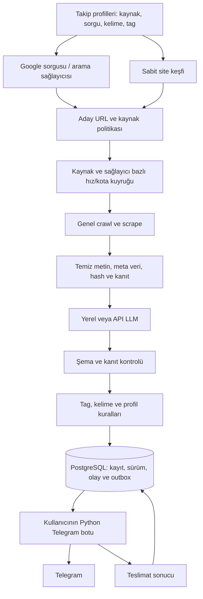

# Bilgi ve fırsat radarı — Telegram odaklı teknik plan

Sürüm 4 — 24 Eylül 2026. Kullanıcının son kararı: **Ruby ile uygulama geliştirme**. İlk çalışan sürümün kurulumu, uygulanmış özellikleri ve henüz eksik kapsamı [uygulama belgesindedir](UYGULAMA.md). Aşağıdaki maddeler hedef mimaridir; tamamı uygulanmış sayılmaz. [V1](arsiv/TEKNIK_GOREV_V1.md) ve [V2](arsiv/TEKNIK_GOREV_V2.md) arşivdedir.

## 1. Güncel hedef

**Belirlenen siteleri ve Google gelişmiş arama sorgularından bulunan adresleri düzenli keşfeden/tarayan; içeriği yerel veya API tabanlı LLM ile analiz eden; tag, kelime ve kullanıcı kurallarıyla ilgili bilgileri seçip Telegram'a aktaran servis.**

İlk teslimatta web arayüzü yok. TUI önceki isteğin sonraki aşamasında kalabilir; ilk teslimatın şartı değildir. Yapılandırma dosyası, CLI durum çıktısı ve Telegram yeterlidir. Blog ve CRM/ERP ertelenmiştir. Kafka/Prometheus/Grafana gerekmiyor.

Sistem bir etkinlik türüne bağlı olmayacak. Etkinlik, buluşma, iş ortaklığı, iş ilanı, ürün/hizmet duyurusu, haber veya başka bir bilgi izlenebilir. Hangi tür/konu/konumun ilgili olduğuna **takip profili** karar verir. Önceki AI/yazılım/siber güvenlik odağı örnek profildir; çekirdeğe değişmez filtre olarak gömülmez. Kullanıcının son talebiyle eğitim, bootcamp/sertifika ve indirim/fiyat takibi şimdilik ertelendi; bunlara özel sorgu, çıkarım ve alarm ilk teslimatta yok.

Ruby servisi analiz edilmiş kayıtları ve gönderim işlerini hazırlar; bot gönderim sonucunu döndürür. İlk uygulamada hazır Ruby Telegram göndericisi vardır; kullanıcı kendi Python botuyla aynı claim/ack API'sine bağlanabilir. İlk LLM adaptörleri Gemini ve Mistral API'dir. Yerel LLM daha sonraki adaptör hedefidir.

## 2. Veri akışı



Şemadaki bot–veritabanı bağlantısı kalıcı veri akışını gösterir; uygulamada bot servis API'si üzerinden claim/ack yapar, tablolara doğrudan yazmaz. Keşif, tarama, LLM ve gönderim bağımsız kalıcı işlerdir; bir sağlayıcının kesintisi diğer kayıtları durdurmaz.

## 3. Takip profili ve iki keşif kanalı

Her profil şu alanları taşır: ad/aktiflik, seed URL'leri, arama sorguları, sorgu ve sayfa bütçesi, izinli/engelli domainler, yeni domain politikası, konu/tag/kelime kuralları, isteğe bağlı tür/konum/dil/tarih filtreleri, LLM ayarı, Telegram target_ref, kontrol aralığı ve başlangıç bildirimi tercihi.

**Sabit site kanalı:** verilen liste/sitemap/grup sayfalarından bağlantıları bulur, yeni veya değişen detayları işler. Kaynak örnekleri [envanterdedir](../arastirma/firsat_radari_kaynaklari.json); bu liste çalışma yapılandırması veya kapsam sınırı değildir.

**Arama kanalı:** gelişmiş sorguları bir arama sağlayıcısına verir. Başlangıç adayı SerpAPI Google Search API'dir. Google arayüzünün doğrudan sınırsız taranabileceği varsayılmaz. Sonuçtaki başlık/snippet/URL keşif verisidir; esas analiz için mümkünse kaynak sayfa alınır. Sayfaya erişilemezse öğe `snippet_only` olarak saklanır ve tam içerikle doğrulanmış gibi bildirilmez; profil isterse bu durumu açıkça belirterek keşif bildirimi gönderebilir.

Yeni bulunan domainlerde varsayılan `review_new_domains`: kaynak erişim politikası değerlendirilmeden derin tarama yapılmaz. Önceden değerlendirilen domainler otomatik ilerler. Sonuç URL'sinin halka açık olması, kısıtlı alanlara erişim izni oluşturmaz.

Örnek sorgular yalnızca taslak; otomatik çalıştırılmadı:

```text
site:kommunity.com ("yapay zeka" OR "siber güvenlik")
site:techcareer.net hackathon
("iş ortaklığı" OR "partner arıyoruz") "yazılım"
("teknoloji" OR "yazılım") ("buluşma" OR "konferans")
intitle:duyuru "kurumsal çözüm"
```

`site:`, ifade araması ve diğer operatörlerin davranışı sağlayıcı sözleşme testinde doğrulanır. Sayfalama ve sonuç sayısı bütçelidir. Sorgu sabit yıl içermez; gerekiyorsa tarih penceresi çalışma zamanında oluşturulur. İndeksin eksiksiz/güncel olduğu veya yeni içeriğin hemen Google'da görüneceği garanti edilmez. Sabit site kontrolü arama indeksine bağımlılığı azaltır.

## 4. Genel crawler — site başına selector yok

Ortak yöntemler: link/sitemap keşfi, varsa standart JSON-LD, genel ana metin çıkarımı ve ihtiyaç varsa izinli JavaScript render. Firecrawl veya aynı görevi yapan yerel genel okuyucu adaptör olabilir. Yerel LLM kullanmak, bütün toplama işlemlerinin de yerel olmasını zorunlu kılmaz; toplama ve LLM tercihleri ayrıdır.

Siteye özgü CSS/XPath selector geliştirme ilk planın parçası değildir. Kaynak ayarları yalnızca seed, host/path sınırı, azami derinlik/sayfa/boyut, timeout, aralık, eşzamanlılık ve varsa yetkili oturum referansı içerir. Genel yöntem içeriği alamıyorsa kaynak hatası/eksik kapsam olarak kaydedilir.

Sonsuz takvim, takip parametreleri ve yinelenen bağlantılar sınırlandırılır. Kayıt kimliği taşıyan URL parametreleri korunur. Liste sayfasından birden çok bilgi çıkabilir; LLM çıktısı `items[]` olur. Modelin ürettiği rastgele URL doğrudan takip edilmez; gerçek keşfedilmiş bağlantılar ve domain politikası doğrulanır.

Tam siteyi her seferinde baştan almak yerine artımlı kontrol uygulanır: değişen liste → yeni detay; takipteki kayıtlar → seçili periyodik kontrol. ETag/Last-Modified destekleniyorsa kullanılır; içerik hash'i aynıysa aynı çıkarım sürümü yeniden çalıştırılmaz. Detay kontrolü, listede görünmeyen iptal/tarih değişimlerini de yakalamayı amaçlar.

## 5. Rate-limit ve engellenme yönetimi

Amaç kararlı ve izinli erişimdir. Hedef sitenin sınırını IP/hesap değiştirerek aşmak veya açık erişim yasağını otomatik delmek planlanmaz. Gerçek ihtiyaç; engellenmeyi önlemek, geçici sınırları doğru yönetmek ve kalıcı engelde yetkili erişim yolu bulmaktır.

| Sinyal | Sistem davranışı | Devam koşulu |
|---|---|---|
| 429 / hız sınırı | Retry-After varsa uygula; yoksa sınırlı artan bekleme + jitter, kaynak eşzamanlılığını azalt | Bekleme ve ilgili kota penceresi dolunca |
| Sağlayıcı günlük/aylık kotası bitmiş | İlgili sağlayıcı işlerini beklet; diğerleri sürer | Kota yenilenmesi veya yetkili plan/bütçe değişimi |
| Ağ timeout / geçici 5xx | Sınırlı retry; tekrarda devre kesici | Bekleme sonrası az sayıda deneme |
| 401 / oturum süresi dolması | İşi durdur; varsa yetkili token yenileme akışını uygula | Geçerli ve yetkili kimlik doğrulama |
| 403 / açık IP engeli / CAPTCHA | Israrlı retry ve otomatik proxy döndürme yapma; erişim sorunu kaydet | Site sahibinin izin/allowlist'i, yetkili API/feed veya manuel çözüm |
| 200 ama challenge/hata sayfası | İçeriği geçersiz işaretle; son geçerli veriyi koru | Gerçek içerik alınabilmesi |
| 404 / listeden kaybolma | Kaydı hemen iptal/silme; kaynak statüsünü doğrula | Kanıtlı kaldırılma veya inceleme sonucu |

Ortak zamanlayıcı bütün worker'lar için **hedef domain**, sağlayıcı hesabı ve global toplam bütçeyi birlikte uygular. Hedef siteye birden fazla adaptörden giden yük mümkün olduğu ölçüde aynı kaynak bütçesine dahil edilir. Proxy sayısı limiti çarpmaz. Uzak crawler'ın kendi yaptığı hedef istekleri tamamen kontrol edilemiyorsa sağlayıcının desteklediği sınırlar doğrulanır; tam kontrol varmış gibi davranılmaz.

Önleme araçları: düşük başlangıç eşzamanlılığı, artımlı tarama, önbellek, sınırlı derinlik, gereksiz render yapmama, anlaşılır istemci kimliği gereken doğrudan isteklerde uygun tanıtım ve kaynak koşullarına uyma. Başlangıç sayıları siteye göre yapılandırılır; evrensel “ban yemeyen istek hızı” yoktur.

Proxy yalnızca izinli ağ çıkışı, bölgesel erişim veya sağlayıcının desteklediği yetkili kullanım için değerlendirilebilir. Bir site engelliyorsa aynı bilginin açık resmî API/feed/başka yetkili kaynaktan alınması tercih edilir. Arama/snippet veya başka kaynağa düşülürse kanıt seviyesi ve veri yaşı görünür olur.

Sağlayıcı hataları tek biçimde varsayılmaz: SerpAPI hata gövdesiyle hız/kota ayrımı yapılır; Firecrawl plan ve endpoint sınırları ayrı yönetilir. Dayanaklar: [SerpAPI hata kodları](https://serpapi.com/api-status-and-error-codes), [Firecrawl rate limits](https://docs.firecrawl.dev/rate-limits). Sabit güncel kota/fiyat iddiası yoktur; hesap üzerinden doğrulanır.

## 6. Yerel veya API LLM

Ortak arayüz: `analyze(document, profile, schema_version) -> items[]`. Sağlayıcı adaptörü uygulama ayrıntılarını saklar. Yerel seçenek için Ollama örneği; API seçeneği için Mistral veya seçilen başka sağlayıcı. [Ollama API](https://docs.ollama.com/api/introduction) yerel model sunucusunu destekler; yerel profil gerçekten yerelde çalışan model seçmelidir, buluta yönlenen model değil. [Mistral yapılandırılmış çıktı](https://docs.mistral.ai/studio/conversations/structured-output/custom) JSON şemasına uygun yanıt için kullanılabilir.

Konfigürasyon: mode/provider/base_url/model, sır referansı, context/token sınırı, timeout, eşzamanlılık, şema ve prompt sürümü. Yerel modda varsayılan bulut fallback kapalıdır; hata halinde içerik sessizce API'ye gönderilmez. API fallback ayrıca seçilirse veri gönderimi ve maliyeti açıkça tanımlanır.

LLM görevleri: ayrı bilgileri çıkar, tür/konu/tag öner, alaka kararı ve kısa gerekçe ver, kaynaklı özet üret. Alanlar: başlık, tür, özet, konular, kaynak kanıtları, var ise tarih/konum/kurum/koşullar. Tarih/konum her bilgi türünde zorunlu değildir. Bilinmeyen tür `other` olabilir; sistem kaydı sırf etkinlik şemasına uymadı diye kaybetmez. Ertelenmiş eğitim/indirim içerikleri ilk pilotta bildirime alınmaz.

Çıktı `relevant / irrelevant / uncertain`; eksik alan `null`. JSON şeması yanında kanıt ve iş kuralı doğrulaması yapılır. Şemaya uygunluk doğruluk garantisi değildir. API hatası veya bozuk JSON “alakasız” sayılmaz; inceleme/yeniden denemeye gider. Sayfa içindeki talimatlar çalıştırılmaz; LLM shell/SQL/Telegram gönderimi veya araç çağrısı yapamaz.

Uzun belgeler sınırda sessizce kesilmez: anlamlı bölümlere ayrılır, bölüm/kanıt referansları korunur, sonuçlar birleştirilir. Aynı sayfadaki birden çok kayıt için öğe bazında kimlik oluşturulur. Model/prompt/şema/profil sürümü ve içerik hash'i önbellek anahtarına dahildir. Donanım uygunluğu ve yerel model kalitesi pilot örneklerle ölçülür; düşük RAM'de büyük modelin hızlı çalışacağı vaat edilmez.

## 7. Tag/kelime ve olay motoru

`source_tags`, `inferred_tags`, `user_tags` ayrı tutulur. Türkçe Unicode/harf dönüşümü ve eşanlamlı sözlük sürümlenir; özgün metin korunur. `AI`, `mail` içinde alt dize olarak eşleşmez. Tam token/ifade eşleşmesi ve seçilen arama alanları kullanılır; footer/menü varsayılan olarak dışarıdadır.

Dahil tag ve kelimeler için ANY/ALL, hariç koşullar, isteğe bağlı tür/konum/tarih: her boyut kendi kuralını uygular, boyutlar AND ile birleşir. Hariç eşleşmesi önceliklidir. Boş boyut kısıt yoktur. Belirsiz alanın daraltılmış filtreye dahil edilmesi açık seçimdir. Anlamsal alaka LLM'de, kullanıcının kesin filtreleri deterministik motordadır. Her kararın gerekçesi saklanır.

Tekilleştirme: kaynak kimliği + kanonik URL + öğe kimliği; kaynaklar arası benzerlik şüpheli birleşme adayıdır. Etkinlik, haber ve ortaklık kayıtları için ayrı anahtar stratejileri olabilir. Aynı içerik farklı Google sorgularında bulununca tekrar gönderilmez; tüm keşif referansları korunur.

Olaylar: yeni ilgili kayıt, önemli değişiklik, doğrulanmış iptal/kapanış ve seçilmiş son tarih. Banner/liste sırası değişikliği olay değildir. İlk yükleme sessiz baseline; istenirse tek başlangıç özeti. Kural/model sürümünü değiştirmek geçmiş kayıtları kendiliğinden yeni olay olarak yağdırmaz; yeniden değerlendirme ayrı ve varsayılan sessizdir.

Fiyat geçmişi, kampanya/kupon çıkarımı ve eğitim/sertifika takibi ertelenmiş kapsamdır. Güncel iş paketlerine dahil değildir.

## 8. Kalıcılık ve Telegram teslimi

PostgreSQL: `profiles`, `sources`, `search_queries`, `discovery_hits`, `jobs`, `documents`, `items`, `item_versions`, `rule_matches`, `events`, `notification_outbox`, `delivery_attempts`, `audit_log`. İçerik türüne özel alanlar sürümlü JSONB veya ilişkili tablolarda tutulabilir; ortak kimlik/kaynak/zaman alanları sabittir.

İşler lease ile sahiplenilir; restart sonrası kalır. Eski sonuç yeni sürümü ezmez. Kayıt sürümü, olay ve outbox tek transaction; olay/hedef benzersizdir. Birden çok profil aynı olaya aynı hedefte eşleşirse tek teslimat, çoklu gerekçe olur. Saklama temizliği bekleyen outbox'ı silmez.

Python bot sözleşmesi: `POST /notification-jobs/claim`, `/{id}/ack`, `/{id}/fail`, `/{id}/renew` (ortak `/api/v1` altında). Claim `delivery_id`, `claim_token`, `lease_until`, `target_ref` ve bildirim yükü döndürür. Ack Telegram message_id/sent_at içerir. Fail transient/permanent/unknown_delivery ve varsa retry_after taşır. Geçerli claim ve yetkili tüketici zorunludur; bot DB tablolarını doğrudan değiştirmez.

Bildirim: **ne bulundu + neden ilgili + kısa bilgi + varsa tarih/konum + kaynak linki + kontrol zamanı + kanıt durumu**. `target_ref` kullanıcının botundaki izinli chat eşlemesine gider; kaynak metni hedef belirleyemez. Tek bir kayıt türüne özgü mesaj şablonu zorunlu değildir.

Uzun metin özetlenir/bölünür, biçimlendirme kaçışlanır; `sendMessage` sınırları uygulanır. Bildirim yoğunluğunda ayarlanabilir özetleme ve hedef başına hız sınırı kullanılabilir. [Telegram Bot API](https://core.telegram.org/bots/api#sendmessage). Gönderim sonrası yanıt/ack kaybında belirsiz teslim ve nadir çift mesaj mümkündür; kesin bir kez teslim garantisi verilmez. Bot kapalıyken kuyruk korunur.

## 9. Teknoloji, dağıtım ve ilk görevler

Ana servis Ruby + Net::HTTP + Nokogiri + pg; bot sözleşmesi için loopback WEBrick HTTP API. PostgreSQL ortak kalıcılık; hazır Ruby botu veya haricî Python botu API üzerinden gönderim yapar. Windows ve Ubuntu hedeflenir. CLI: yapılandırma doğrula, şema hazırla, tek tur çalıştır, worker başlat, durum/inceleme listesi. TUI/web bağımlılığı yok. Yerel LLM ve Firecrawl adaptörleri henüz uygulanmadı.

AWS küçük sunucu başlangıç önerisi: Ubuntu Server, 2 vCPU / 2 GiB RAM, API LLM, bir veya iki hafif HTTP toplama işi ve küçük yerel PostgreSQL. Yerel LLM ve ağır tarayıcı eşzamanlılığı bu profile dahil değildir. Ücretsiz kullanım ve CPU kredi koşulları [AWS kapasite notunda](AWS_KAPASITE_NOTU.md) açıklanır. Bu bir pilot tahmini; uygulama üzerinde kapasite testi henüz yok.

| ID | Görev | Kabul |
|---|---|---|
| V3-01 | Profil şeması, kaynaklar ve sorgular | Sabit site ve arama ayrı tanımlı; tür/konu kod içine gömülü değil |
| V3-02 | Kalıcı kuyruk ve kaynak politikası | Domain/sağlayıcı limitleri tüm worker'larda ortak; restart ve kota testleri |
| V3-03 | Sabit site + arama keşfi, genel okuyucu | Siteye özel selector yok; keşif referansı, URL tekilleştirme, erişim hatası |
| V3-04 | Yerel ve API LLM adaptörleri | Aynı şema; model/profil sürümü, kanıt, hata ve açık fallback politikası |
| V3-05 | Tag/kelime ve olay motoru | ANY/ALL/hariç, çoklu tür, anlamsal karar, sessiz yeniden değerlendirme |
| V3-06 | Python bot claim/ack entegrasyonu | Kalıcı outbox, yetkili hedef, mesaj sınırı ve teslimat belirsizliği |
| V3-07 | Windows/Ubuntu pilotu ve kullanım belgesi | Servis restartı, yerel/API çalışma, CLI, gerçek/sahte bot testleri |

İlk pilot: en az bir izinli sabit kaynak, bir arama sorgusu, bir yerel ve bir API LLM çalışma denemesi; en az üç farklı bilgi türü. Hesap/erişim eksikse ilgili adaptör sahte yanıtla test edilir ve canlı test yapılmadığı belirtilir.

Kritik kabul testleri: 429 bekleme, kota tükenmesi, 403 sonrası duraklama, 200 challenge sayfası, SSRF/yönlendirme kontrolü, LLM bozuk JSON/timeout, uzun sayfada çoklu kayıt, eski tarih, tekrar sorguda tek olay, bot kesintisi, ack kaybı ve aynı kuralların iki LLM'de insan etiketleriyle kıyası. `AI`/`mail` ve Türkçe harf testleri dahil. LLM alaka hataları ayrı değerlendirme kümesinde yanlış kabul/ret olarak ölçülür; aynı model doğruluğu varsayılmaz.

Yerel HTTP/LLM uçları varsayılan loopback; uzaktan erişim açılırsa kimlik doğrulama/TLS. PostgreSQL internete açılmaz. Hedef URL/yönlendirme/DNS özel ağ ve metadata erişimine karşı denetlenir. Loglarda API anahtarı/token yok. Ham içerik ve modelin elenmiş kayıt gerekçeleri sınırlı saklanır.

## 10. Açık girdiler ve kapsam dışı işler

Gerçek takip profilleri, seed/sorgu listesi, kontrol sıklığı, sağlayıcı bütçesi, yerel model donanımı ve bot tüketici ayarları uygulama başlangıcında netleştirilecek. Mevcut kaynak envanteri bunlara başlangıç verir; yalnızca etkinlik listesi olarak sınırlandırmaz. “Expo İstanbul” kesin URL'si ve kanal listesi hâlâ verilmedi; bunlar diğer kaynaklarla çalışmayı engellemez.

Web, blog, CRM/ERP ve kapsamlı TUI sonraki aşamalardır. Ruby uygulaması yerel birim/entegrasyon testleriyle doğrulandı; otomatik canlı tarama veya Telegram mesajı gönderimi başlatılmadı.
