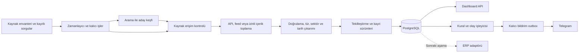

# Etkinlik ve fırsat takip sistemi — teknik görev dokümanı

> Arşiv: bu sürümün yerini [Fırsat Radarı sürüm 2](../TEKNIK_GOREV_DOKUMANI.md) almıştır.

Sürüm: 1.0 — 24 Eylül 2026. Durum: geliştirmeye esas öneri; uygulama henüz yazılmadı.

## 1. Güncel hedef

Türkiye genelinde tüm sektörlere açık **etkinlik, işe alım ilanı, ticari teklif, iş ortaklığı ve destek çağrısı** takibi. Kullanıcılar fırsatları yerel web dashboard'unda filtreleyebilecek, takip kuralları tanımlayabilecek ve yetkili Telegram sohbetlerinde bildirim alabilecek. Sunucu hazır olduğunda aynı uygulama sunucuda sürekli çalışacak. ERP entegrasyonu bu çekirdek tamamlandıktan sonra yapılacak.

Bu sürüm, önceki `TEKNIK_YOL_HARITASI.md` içindeki ürün/fiyat odaklı ilk teslimatın yerini alır. Önceki belgedeki kuyruk, outbox, kaynak izinleri ve güvenilirlik ilkeleri korunur. Fiyat izleme daha sonra ayrı kayıt türü olabilir.

Bu turdaki teslimatlar araştırma ve görev belgeleridir. “Lokalde çalışır”, “Telegram bağlı”, “canlı tarama başladı” veya “ERP hazır” iddiası yoktur.

## 2. Kavramlar ve başarı tanımı

| Kayıt türü | Anlamı | Zorunlu ek ayrım |
|---|---|---|
| `event` | Fuar, konferans, atölye, konser, mesleki buluşma | Etkinlik tarihi ile kayıt son tarihi ayrı |
| `job` | İşverenin işe alım/staj ilanı | Ticari iş teklifi veya tedarik talebi değil |
| `commercial_offer` | Ürün/hizmet alım-satım talebi, ihale | Alım/satım yönü ve teklif son tarihi |
| `partnership` | Kurucu ortak, distribütör, Ar-Ge veya ticari partner arayışı | Aranan ortak türü ve uygunluk koşulu |
| `support_call` | Destek, hızlandırıcı, fon veya proje çağrısı | Başvuru dönemi ve katılım şartı |

Kaynak envanterindeki Türkçe tür kodları içe aktarımda bu kodlara eşlenir; bu dönüşüm belgelenir. Bir kaynak birden fazla kayıt türü yayımlayabilir.

Kullanıcı akışı: **Filtrele → kaydı incele → takip et/kaydet → değişikliği veya son tarihi öğren → sonraki aksiyonu belirle.** Sistem ilk aşamada başvuru yapmaz, bilet satın almaz veya müşteri/işveren adına mesaj göndermez.

“Canlı dashboard” ilk sürümde veritabanındaki son durumu 30 saniyede bir yeniler. Kaynak kontrol aralığı bundan bağımsızdır. Son kaynak kontrolü ve başarısız kontrol uyarısı gösterilir. Bilgisayar veya worker kapalıyken veri toplama ve bildirim çalışmaz; sunucuya taşındığında tarayıcının açık olması gerekmez.

## 3. Mimari ve teknoloji kararı

Öneri: önceki planla tutarlı biçimde Rust ile modüler tek uygulama. Go kabul edilebilir alternatif; geliştirme başlangıcında ekip Go'yu seçerse aynı sözleşmeler korunur ve yalnızca bir backend dili kullanılır. Bu seçim için hız üstünlüğü iddiası yok; belirleyiciler ekip yetkinliği, API bekleme süreleri ve işletim kolaylığıdır.

| Teknoloji | Görev |
|---|---|
| Rust + Tokio | Zamanlayıcı, işleyiciler, normalizasyon ve iş kuralları |
| Axum | Dashboard için REST API ve sağlık uçları |
| reqwest + serde | Sağlayıcı çağrıları ve tipli JSON dönüşümü |
| PostgreSQL + SQLx | Kayıtlar, gözlemler, kalıcı işler, abonelikler ve bildirim outbox'ı |
| React + TypeScript + Vite | Dashboard; üretim derlemesi backend üzerinden sunulur |
| SerpAPI | Kaynak/sorgu bazlı aday URL keşfi |
| Resmî kaynak API/feed'i veya izinli Firecrawl | Detay içeriği toplama; her kaynağın yöntemi ayrı |
| Telegram Bot API | Yetkilendirilmiş bildirim ve sınırlı bot komutları |
| Docker Compose | Yerel uygulama + veritabanı; sonrasında sunucuya aktarılabilir yapı |

Resmî teknik dayanaklar: [Tokio](https://tokio.rs/), [Axum](https://docs.rs/axum/latest/axum/), [SQLx](https://github.com/transact-rs/sqlx), [React](https://react.dev/), [Vite](https://vite.dev/guide/), [SerpAPI](https://serpapi.com/search-api), [Firecrawl](https://docs.firecrawl.dev/features/scrape), [Telegram Bot API](https://core.telegram.org/bots/api). Sürümler uygulama başlangıcında uyumluluk kontrolüyle sabitlenecek.

AI ilk sürümün zorunlu bağımlılığı değildir. Kurallarla sınıflandırılamayan kayıtlar incelemeye alınabilir. AI eklenirse alan çıkarımına yardımcı olur; tarih, başvuru uygunluğu veya kaynak izni uyduramaz. Kaynak metni talimat olarak çalıştırılmaz; her çıkarım kaynak referansıyla saklanır.

## 4. Murat / frontend geliştiricisi için ekran sözleşmesi

Aşağıdaki adlar görev önerisidir; kişilere atama veya mesaj gönderimi yapılmadı. Eda adı ses notunda belirsiz olduğundan rol üzerinden planlanmıştır.

| Ekran | Kullanıcıya görünenler | İşlemler ve kabul ölçütü |
|---|---|---|
| Dashboard / fırsatlar | Başlık, tür, sektör, şehir/çevrim içi, organizatör/şirket, tarih, kaynak, kayıt durumu, son kontrol | Arama; çoklu il/sektör/tür; tarih, açık/kapalı/bilinmiyor filtreleri; sıralama ve sayfalama. Filtreler URL'de korunur. |
| Kayıt ayrıntısı | Kaynak bağlantıları, açıklama, uygunluk, tarihlerin kanıtı, değişiklik geçmişi | Kaydet, ilgisiz işaretle, kaynakta aç. Kaydı okundu işaretlemek aboneliği değiştirmez. |
| Takipler | Kural adı, kapsadığı sektör/il/tür/sözcük, hariç tutulan sözcük, hedef, kontrol bilgisi | Oluştur/düzenle/duraklat; mevcut kayıtlarla eşleşme önizlemesi. Sadece izleme yetkisi olan düzenleyemez. |
| Kaynaklar | Domain, erişim yöntemi/izin durumu, son başarılı deneme, hata, sonraki kontrol | Yönetici etkinleştir/duraklat/manuel yenile. İzin doğrulanmadıysa otomatik toplama açılamaz. |
| Bildirim geçmişi | Kayıt, olay nedeni, hedefin maskeli adı, durum, deneme ve hata | Bekliyor/gönderildi/başarısız/teslimat belirsiz ayrımı. Yeniden deneme yalnızca yetkili kullanıcıda. |
| Ayarlar | Telegram bağlantı durumu, yetkili hedefler, saat dilimi, toplama bütçesi | Test mesajı yalnızca yapılandırılmış izinli hedefe. Sırlar frontend yanıtlarına dönmez. |

İlk sürüm için liste ve ayrıntı yeterli; takvim görünümü P1'dir. Yaklaşan tarihler listede ve sıralamada görünür. Açılışta filtreler ve kayıtlar hemen erişilebilir olmalı; tanıtım sayfası gerekmez.

Her ekranda yükleniyor, boş liste, filtre sonucu yok, bağlantı kesildi ve işlem hatası durumları tasarlanır. Tarih bilinmiyorsa boşluk yerine “Tarih doğrulanmadı”; ücret bilinmiyorsa “Ücret belirtilmedi” yazılır. 81 il seçimi, çevrim içi/hibrit ve konumu belirsiz seçenekleri bulunur. Klavye ile kullanım, dar ekran ve Türkçe karakterler desteklenir. Tam sosyal profil/iletişim bilgisi çekmek listeleme için gerekli değildir.

Frontend backend'i beklemeden, sözleşmedeki örnek yanıtlarla başlayabilir. Örnek içerik “demo” olarak işaretlenir; canlı kaynak gibi gösterilmez.

## 5. Veri modeli ve tarih kuralları

| Varlık | Asgari alanlar |
|---|---|
| `sources` | id, domain, liste URL'si, kaynak tipi, erişim/izin kaydı, yöntem, kontrol aralığı, aktiflik, son başarı/hata |
| `source_items` | source_id, external_id veya kanonik URL, ilk/son görülme, içerik hash'i, ham içerik referansı |
| `opportunities` | id, kind, title, summary, sectors[], location, organization, lifecycle_status, review_status |
| `opportunity_versions` | kayıt id, version, değişen alanlar, kaynak referansları, observed_at, extractor_version |
| `subscriptions` | sahibi, filtreler, olay türleri, Telegram hedefi, etkinlik, baseline zamanı |
| `saved_items` | kullanıcı, kayıt, kaydedildi/ilgilenilmiyor, güncelleme tarihi |
| `jobs` / `events` / `notification_outbox` | işin/olayın benzersiz anahtarı, durum, deneme, next_attempt_at, lease ve gönderim sonucu |
| `users` / `roles` / `telegram_access` | kullanıcı ve chat için ayrı izin; yönetici/editör/izleyici |
| `audit_log` | aktör, işlem, kayıt, eski/yeni değer özeti, zaman |
| `erp_links` | sonraki aşamada kuruluş, yerel kayıt, ERP türü/id, aktarım sürümü ve sonuç |

Ortak tarih alanları: `published_at`, `first_seen_at`, `observed_at`, `starts_at`, `ends_at`, `application_deadline`, `timezone`, `date_precision`, `date_evidence`. Kaynakta yalnızca gün varsa kesin saat uydurulmaz; `date_precision=date` kullanılır. Hatırlatma için gün bazlı hesaplama politikası açıkça tanımlanır. Geçerlilik zamanı ile veri toplama zamanı birbirinin yerine kullanılamaz.

`lifecycle_status`: upcoming / ongoing / closed / cancelled / unknown. `review_status`: verified / needs_review / rejected. Etkinliğin kayıt başvurusu ayrıca open / closed / unknown olabilir; başvurusu kapalı etkinlik hâlâ yaklaşan etkinlik olabilir. İşe alım ilanındaki iş başlangıç tarihiyle ilan son tarihi ayrı tutulur.

Bir kaydın farklı kaynaklarını `source_items` ilişkisi korur. Önce kaynak kimliği/kanonik URL ile kesin tekrar ayıklanır; başlık + organizatör + tarih/yer benzerliği yalnızca birleştirme adayı üretir. Tarih değişikliği yeni etkinlik sanılmamalı; her yıl tekrarlanan fuar da geçen yılla birleştirilmemeli. Birleştirme kaynak kayıtlarını silmez ve geri alınabilir olmalıdır.

## 6. Toplama ve bildirim davranışı

1. Kaynak ve kayıtlı sorgular manuel envanterden eklenir. SerpAPI aday URL bulur; sonuç özeti tek başına doğrulanmış fırsat değildir.
2. Domain, erişim yöntemi ve izin durumu kontrol edilir. Üyelik alanı için uygun hesap/izin yoksa kayıt manuel inceleme bekler.
3. Başarılı toplama sonrası şema ve alanlar doğrulanır. 200 yanıtı hata sayfası olabilir; Firecrawl hedef sayfa durumu da kontrol edilir. Geçersiz sonuç son geçerli kaydı ezmez.
4. İlk yükleme mevcut kayıtları sessiz referans veri olarak alır. İlk yükleme bitince oluşan yeni doğrulanmış kayıtlar abonelikleri tetikler. Kullanıcı isterse mevcut uygun kayıtlar için tek başlangıç özeti alabilir.
5. Olaylar: yeni kayıt, önemli tarih/konum değişikliği, açıkça doğrulanmış iptal/kapanış ve yaklaşan son tarih. Görsel/banner veya liste sırası değişikliği fırsat alarmı değildir.
6. Listeden kaybolma tek başına kapanış sayılmaz. Detay sayfası/kaynak statüsüyle doğrula; doğrulanamıyorsa “kaynakta bulunamadı / inceleme” olarak işaretle.
7. Son tarih hatırlatması ilk sürümde isteğe bağlı 24 saat önce tek kez gönderilir. Tarih değişirse bekleyen eski hatırlatma iptal edilir. Son tarihin geçtiği veya belirsiz olduğu durumda yaklaşan tarih alarmı üretilmez.
8. Bildirim eşleşmesi kayıt türü + il + sektör + sözcük koşullarının birleşimidir. Aynı grupta çoklu seçim OR, farklı gruplar arasında AND; hariç tutulan sözcük eşleşmesi engelleyicidir. Boş filtre o boyutta kısıt yok demektir. Bilinmeyen sektör/konum daraltılmış filtrede varsayılan olarak eşleşmez; kullanıcı isterse belirsizleri dahil eder.
9. Gözlem sürümü, olay ve outbox aynı transaction'da yazılır. Aynı olay/hedef için birden çok abonelik eşleşirse tek teslimat kaydı oluşur; eşleşen kuralların listesi saklanır.
10. Telegram'da 429 bekleme süresine uyulur; geçici hata sınırlı yeniden denemeye gider. 401/403 yapılandırma/izin hatasıdır. Ağ kopması sonrası teslimat belirsiz olabilir; uçtan uca tam bir kez teslim garantisi verilmez.

Bildirim içeriği: kayıt başlığı, olay nedeni, tür/sektör, şehir, doğrulanmış tarih/son tarih, kaynak bağlantısı, gözlem zamanı ve kısa olay kimliği. Özel dashboard bağlantıları halka açık veri paylaşımına dönüşmemelidir. Test mesajı izleme olayından ayrı kayıtlanır.

Bot komutları P0: `/status`, `/list`, `/pause <id>`, `/resume <id>`. Kullanıcı ID'si ile chat ID'si ayrı denetlenir; gruptaki herkes yönetici olamaz. Komutların tekrar işlenmesi etkisizdir. Long polling başlangıç için yeterli; aynı botta birden fazla polling tüketicisi çalıştırılmaz. API ilkeleri [Telegram dokümantasyonuna](https://core.telegram.org/bots/api) göre uygulanır.

## 7. Backend–frontend API taslağı

Bu uçlar önerilen sözleşmedir; çalışan endpoint değildir. JSON tarihleri ISO 8601, kimlikler opak string; liste uçlarında limit ve cursor kullanılır. Başlangıç yanıtı `items`, `next_cursor`, `as_of` içerir. Hatalar `code`, `message`, `request_id`, gerekirse `field_errors` içerir. Yetkilendirme bütün işlemlerde backend'de uygulanır.

| Yöntem / yol | Amaç / temel alanlar |
|---|---|
| `GET /api/v1/opportunities` | q, kind[], sector[], city[], status[], date_from/to, date_field, saved, sort, cursor, limit; tarih filtresinin hangi alanı kullandığı açık |
| `GET /api/v1/opportunities/{id}` | Kaynaklar, tarih kanıtları ve kayıt ayrıntısı |
| `GET /api/v1/opportunities/{id}/history` | Sürüm ve olay geçmişi |
| `PUT /api/v1/me/items/{id}` | saved / dismissed / neutral; tekrar aynı istek güvenli |
| `GET, POST /api/v1/subscriptions` | Takip listeleme ve oluşturma |
| `PATCH /api/v1/subscriptions/{id}` | Kural/aktiflik güncelleme; version ile çakışma kontrolü |
| `POST /api/v1/subscriptions/preview` | Kuralı kaydetmeden örnek eşleşmeler ve gerekçeleri |
| `GET, POST /api/v1/sources` | Kaynakları listele/ekle; araştırma kaydı eklemek otomasyonu açmaz |
| `PATCH /api/v1/sources/{id}` | İzin, yöntem, aralık, aktiflik; yönetici |
| `POST /api/v1/sources/{id}/refresh` | Tekilleştirilmiş arka plan işi; 202 + job_id |
| `GET /api/v1/notifications` | Filtrelenebilir teslimat geçmişi |
| `GET /api/v1/settings/telegram` | Sırlar olmadan yapılandırma ve hedef durumu |
| `PUT /api/v1/settings/telegram/targets` | Yetkili hedefleri yönet; admin, audit kaydı |
| `POST /api/v1/telegram/test` | Sadece izinli target_id; hız sınırı ve audit |
| `GET /health/live`, `GET /health/ready` | Süreç / veritabanı hazır oluşu; sır içermeyen yanıt |

Oluşturma ve işi tetikleme uçları `Idempotency-Key` kabul eder. Harici webhook/ERP yolları, sonraki entegrasyon aşamasında ayrı sözleşmeyle açılır. Şema görevinde bu taslak OpenAPI'ye dönüştürülür; frontend örnek yanıtları aynı şemadan türetilir.

## 8. İş paketleri ve bağımlılıklar

Eforlar kişi-gün tahminidir; ekip yetkinliği, API erişimi ve kaynak çeşitliliğine göre değişir. Sağlayıcı izin bekleme süresi dahil değildir. Bir haftalık ERP beklentisi bu projenin teslim tarihi veya ERP'nin açıldığına dair bilgi sayılmaz.

| ID | İş paketi | Rol / olası kişi | Bağımlılık | Efor | Bitme ölçütü |
|---|---|---|---|---|---|
| T01 | Kaynak doğrulama ve izin değerlendirmesi | Araştırma/QA — Eda veya atanacak kişi | Yok | 2–3 | 24 kayıt gözden geçirilmiş; pilot kaynaklarda erişim yöntemi ve örnekler hazır |
| T02 | Veri şeması, OpenAPI ve örnek yanıtlar | Backend — Bünyamin | Bu belge | 1–2 | Tür/tarih/belirsizlik sözleşmesi; migration ve örnekler |
| T03 | Rust iskeleti, DB ve kalıcı işler | Backend | T02 | 2–3 | Yeniden başlatmada iş ve kayıt kaybı yok |
| T04 | Dashboard liste/ayrıntı/takip/kaynak ekranları | Frontend — Murat | T02 | 3–5 | Örnek yanıtlarla bütün ana kullanıcı akışları ve hata durumları |
| T05 | İzinli kaynak adaptörü ve SerpAPI keşfi | Backend + araştırma | T01, T03 | 3–5 | En az iki gerçek izinli kaynak; sahte/bozuk yanıt senaryoları |
| T06 | Sınıflandırma, tarih ve tekrar tespiti | Backend + QA | T02, T05 | 2–3 | Eski dönem ve çelişkili tarih testleri; kayıpsız birleştirme |
| T07 | Abonelik, olay, outbox ve Telegram | Backend | T03, T06 | 2–3 | Eşleşme doğru; yetkisiz komut reddediliyor; retry testleri |
| T08 | Frontend API bağlama ve rol kontrolü | Frontend + backend | T04, T06, T07 | 1–2 | Demo yerine veritabanı kayıtları; işlemler yenilemede korunuyor |
| T09 | Yerel paket, kabul testi ve kısa kullanım kılavuzu | Ekip | T08 | 2–3 | Tek kurulum yönergesi; yedekleme/geri yükleme ve test kanıtları |
| T10 | Sunucuya geçiş | Backend/operasyon | T09 + sunucu erişimi | 1–2 | HTTPS, kimlik doğrulama, kalıcı disk ve otomatik başlama |
| T11 | ERP adaptörü | Backend + ERP sahibi | T09 + ERP sözleşmesi | Sözleşme sonrası | Tek kayıt aktarımı, tekrar deneme ve harici kimlikle sorgu |

Görevler ekip içinde paralel yürütülebilir: T02 sonrası frontend örnek veriyle çalışırken kaynak erişimi ve backend devam eder. Kimsenin adı kesin iş ataması veya takvim taahhüdü değildir. İlk teslimat T09'dur; ERP beklenmez.

## 9. Test ve teslim kabulü

- En az iki izinli canlı kaynakla, en az dört kayıt türünü kapsayan gerçek veya açıkça işaretli test örnekleriyle uçtan uca gösterim. Bütün 24 kaynağın otomatik entegrasyonu MVP şartı değildir.
- Aynı kaynak yanıtını tekrar işlemek yeni fırsat/olay üretmez. İki aboneliğin aynı olaya eşleşmesi aynı hedefte tek outbox kaydı üretir.
- TechAnkara 2024 takvimi, 2026 başvurusu açık alarmı üretemez. Başvuru kapalı olması etkinlik tamamlandı olarak yorumlanamaz.
- Kesin saat verilmeyen tarih bilinçsizce UTC gece yarısına dönüştürülmez. Kaynakta eksik son tarih için değer uydurulmaz.
- Son tarih değişince eski bekleyen hatırlatma gönderilmez. Aynı günün farklı saatleri ve ay/yıl geçişi test edilir.
- 429, timeout, worker çökmesi, kaynak şema değişimi ve Telegram teslimat belirsizliği görünür ve kurtarılabilir.
- SerpAPI/Firecrawl anahtarları, Telegram tokenı ve yetkisiz kişisel bilgiler log/API yanıtına düşmez.
- Yetkisiz Telegram kullanıcısı, izinli grupta olsa da takip değiştiremez. Web rolünü atlayarak doğrudan API çağrısı da reddedilir.
- 10.000 örnek kayıtta tanımlanan pilot makinede liste API'si için p95 1 saniye hedefi ölçülür; donanım ve ölçüm yöntemi rapora yazılır. Bu bir mevcut performans sonucu değildir.
- Yerel ilk kurulum, yeniden başlatma ve yedekten geri yükleme yönergeden uygulanabilir. Dashboard kaynak verisinin yaşını doğru gösterir.

## 10. İşletim ve sınırlar

Yerel varsayılan erişim loopback; ağ/sunucuya açılmadan kimlik doğrulama, rol kontrolü ve TLS zorunlu. PostgreSQL portu internete açılmaz. Sırlar backend ortamından alınır; `.env.example` yalnızca boş örnekler içerir. URL girişleri ve yönlendirmeler özel ağ/metadata adreslerine erişimi engelleyecek şekilde doğrulanır.

Kaynak ve sağlayıcı başına ayrı hız, eşzamanlılık ve bütçe sınırı; kalıcı zamanlama ve kesinti sonrası tek telafi işi. 403/CAPTCHA kaynağı duraklatır; residential proxy erişim yasağını veya kotayı aşma yöntemi değildir. Proxy ancak kaynak/sağlayıcı koşulları içinde, ihtiyaç kanıtlanırsa eklenir.

Örnek maliyet modeli: 24 kaynak listesi günde dört kez kontrol edilirse 96 liste çağrısı/gün; bulunan yeni detaylar, sayfalama, arama ve tekrarlar bunun üzerine eklenir. Liste sayısı, toplam toplanan sayfa sayısı değildir. Gerçek maliyet seçilen API planının birimlerine ve çıkarım seçeneklerine göre ölçülür.

Önerilen başlangıç saklama politikası: ham içerik 30 gün, kayıt/değişiklik/teslimat geçmişi 180 gün; gerekli iş kayıtları ayrıca seçilir. Bunlar ürün varsayımıdır; ekip veri amacı ve işletim ihtiyacına göre kesinleştirir. Silme ve saklama süresi job'ı da test edilir.

## 11. Geliştirme başlamadan kesinleştirilecekler

Pilot kaynak izinleri, sağlayıcı hesap/bütçesi, Telegram test hedefi, Rust/Go son kararı ve ekip sorumluları. ERP için gerekli girdiler [ERP entegrasyon talebinde](../ERP_ENTEGRASYON_TALEBI.md) listelenmiştir. Bu girdiler gelene kadar veri şeması, API sözleşmesi, demo frontend ve sahte sağlayıcı testleri üzerinde çalışılabilir.
