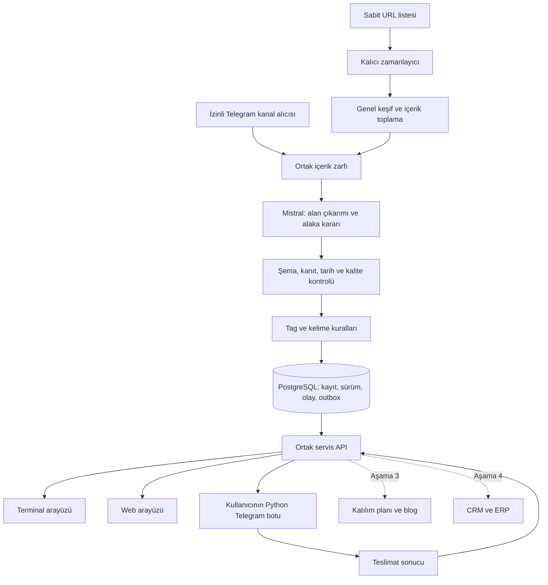

> Arşiv: güncel Telegram odaklı kapsam için [görev dokümanını](../TEKNIK_GOREV_DOKUMANI.md) kullanın.

# Fırsat Radarı — teknik görev dokümanı

Sürüm 2.0 — 24 Eylül 2026. Güncel kullanıcı tarifi esas alınmıştır. Bu teslimat dokümantasyondur; uygulama geliştirmesi henüz başlamadı. [Önceki sürüm](TEKNIK_GOREV_V1.md) tarihsel referanstır.

## 1. Ürün tanımı ve sıra

**AI, yazılım, siber güvenlik ve iş ortaklığı odaklı etkinlikleri/buluşmaları keşfeden; ardından bootcamp, eğitim ve sertifika fırsatlarını ve indirimlerini izleyen; Mistral, titiz tag/kelime filtreleri, PostgreSQL, TUI ve web arayüzü kullanan fırsat radarı.** Telegram gönderimini kullanıcının Python botu üstlenir. Daha sonra katılım planı, etkinlik sonrası blog ve CRM/ERP iş akışları eklenir.

Coğrafya Türkiye geneli; çevrim içi içerikler Türkiye'den katılım uygunluğuyla filtrelenir. Önceki “tüm sektörler ve genel iş ilanları” ilk sürüm kapsamı değildir. Kurumsal çözüm ve iş ortaklığı buluşmaları kapsamdadır; tüm kamu ihaleleri veya alakasız sosyal etkinlikler değildir.

| Aşama | Çıktı |
|---|---|
| 1 — Etkinlik keşfi | Sabit kaynaklar, genel crawler, Mistral, tag/kelime filtreleri, TUI + web, PostgreSQL ve Python bot sözleşmesi |
| 2 — Eğitim fırsatları | Bootcamp/sertifika/eğitim, fiyat geçmişi, doğrulanmış indirim ve son tarih alarmı |
| 3 — Katılım ve blog | Gideceklerimiz, katılım notları, görüşülen şirketler ve onaylı blog yayını |
| 4 — CRM/ERP | Görüşme → takip görevi → ortaklık/fırsat → teklif/operasyon; mevcut ERP backend'iyle uyum |

Kafka, Prometheus ve Grafana ilk teslimat bağımlılığı değildir. Gerekli görünürlük: son kontrol, kaynak hatası, bekleyen işler, filtre gerekçesi ve bildirim sonucu. SerpAPI sabit kaynak taramasının zorunlu parçası değildir; yeni kaynak keşfi için sonradan eklenebilir.

## 2. Canlılık ve çalışma biçimi

“Canlı”, ilgili yeni fırsat veya anlamlı değişiklik fark edildiğinde haber vermektir. Kaynak yayımlama anına erişim yoksa sıfır gecikme vaat edilmez.

Önerilen başlangıç: etkinlik listeleri 15 dakikada, yavaş kaynaklar 60 dakikada; ikinci aşama indirim kaynakları izin ve bütçe uygunsa 5–15 dakikada kontrol edilir. Kaynak koşulları daha uzun aralık gerektirebilir. Bunlar sağlayıcı limiti veya mevcut performans sonucu değildir.

Kaynak yayımlama → ilk görülme, ilk görülme → değerlendirme, uygun olay → Python botuna hazır hale gelme ayrı ölçülür. Pilot hedefi: yoğunluk/kesinti yokken uygun olayın 60 saniye içinde bot tarafından alınabilmesi. Gerçek Telegram teslim süresini bot ayrıca raporlar. Toplam gecikmeye kontrol aralığı, önbellek, kuyruk ve sağlayıcı gecikmesi eklenir.

TUI/web, cursor ile artımlı sorguyu yaklaşık 5 saniyede bir yenileyebilir. “Yeni kayıt yok” ve “kaynak kontrol edilemedi” ayrı görünür. Arayüz yenilemek kaynak taramasını tetiklemez.

TUI kapanınca worker durmaz. Tarama servisi, TUI istemcisi ve Python botu ayrı süreçlerdir. Web ve TUI aynı API ve PostgreSQL kayıtlarını kullanır; kendi filtre motorlarını veya veri kopyalarını oluşturmaz.

## 3. Mimari ve teknoloji

Öneri önceki planla uyumlu olarak Rust. Go kabul edilebilir; ekip Go'yu seçerse servis/TUI o dilde yazılır ve aynı sözleşme korunur. İki ana backend geliştirilmez. Dil seçimi tek başına API bekleme sürelerini azaltmaz.

| Katman | Rust yolu için öneri |
|---|---|
| Worker/zamanlayıcı | Rust + Tokio |
| HTTP/JSON | reqwest + serde |
| Ortak API | Axum |
| TUI | Ratatui ve uygun terminal backend'i |
| Kalıcılık | PostgreSQL + SQLx |
| Web | React + TypeScript + Vite; derlenmiş dosyalar servisten sunulur |
| Genel toplama | Firecrawl map/crawl/scrape veya aynı sözleşmeyi karşılayan genel okuyucu |
| İçerik değerlendirme | Mistral API, yapılandırılmış JSON çıktı |
| Telegram | Kullanıcının Python süreci; API üzerinden claim/ack |

[Ratatui](https://ratatui.rs/) Rust terminal arayüzü kütüphanesidir. [Mistral](https://docs.mistral.ai/studio/conversations/structured-output/custom) şemalı JSON çıktıyı destekler; biçim doğruluğu, içeriğin gerçek olduğunu kanıtlamaz. Paket sürümleri ve model uygulama başlangıcında sabitlenir.

Windows sunucuda yerel servis ikilisi + PostgreSQL + Python botu; Ubuntu Desktop/Server'da yerel servis veya Linux konteyner dağıtımı hedeflenir. Her iki ortam için otomatik başlatma/yeniden başlatma yönergesi hazırlanır. Linux konteynerinin Windows sunucuda kendiliğinden çalışacağı varsayılmaz.

Web arayüzü sunucuda masaüstü gerektirmez; kullanıcının bilgisayarındaki tarayıcıdan da açılabilir. Düşük kaynak profili: bir toplama işi, bir Mistral işi, sınırlı sayfa bütçesi ve TUI. Normal profil: ölçülmüş ihtiyaca göre eşzamanlılık ve web erişimi. Büyük Mistral modelini yerelde çalıştırmak zorunlu değildir. Tarayıcı tabanlı toplamanın kaynak yükü ayrıca ölçülür.

## 4. Sabit kaynaklar ve selector gerektirmeyen crawler

Güncel liste: [firsat_radari_kaynaklari.json](../../arastirma/firsat_radari_kaynaklari.json). Araştırma verisidir; çalışan crawler ayarı değildir.

| Kaynak | Doğrulama / kullanılacak başlangıç |
|---|---|
| [Kommunity](https://kommunity.com/search) | Önceki araştırmada resmî indekste görüldü; ilgili grup ve şehirler seçilecek |
| [Meetup](https://www.meetup.com/) | Platform doğrulandı; Türkiye/il/grup seed adresleri ve erişim şartları seçilecek |
| [Techcareer](https://www.techcareer.net/events) | Bootcamp/hackathon/etkinlik listesi doğrulandı; her eğitim indirimli sayılmaz |
| Telegram kanalları | Kanal listesi verilmedi; uygun erişimi olan alıcıdan ortak içerik zarfıyla alınacak |
| “Expo İstanbul” | Kesin adres belirsiz. [İFM takvimi](https://ifm.com.tr/tr/ifm-fuar-takvimi) doğrulanmış aday; aynı yer olduğu varsayılmıyor |
| TechAnkara / ODTÜ TEKNOKENT | Önceki araştırmadan ilgili ek adaylar; eski dönem duyuruları elenecek |

Akış: seed → bağlantı keşfi → detay sayfaları → normalize içerik → Mistral. Siteye özgü CSS/XPath selector yazılmayacak. Genel yöntem yetersiz kalırsa sessizce özel selector eklemek yerine kapsam/erişim sorunu raporlanacak.

Ortak teknikler: site haritası ve link keşfi, varsa standart JSON-LD Event/Course/Offer, genel ana içerik çıkarımı, gerektiğinde izinli JavaScript render. JSON-LD yoksa Mistral temiz metni okur. Liste sayfası birden çok fırsat içerebilir; çıktı `items[]` olmalıdır. Modelin uydurduğu URL doğrudan çalıştırılmaz; keşfedilmiş bağlantı ve izinli host doğrulanır.

Kaynak ayarları: seed, izinli host/path, azami derinlik/sayfa/boyut, timeout, kontrol aralığı, dil, eşzamanlılık ve varsa yetkili oturum referansı. Bunlar içerik selector'ı değildir. Sonsuz takvim/filtre URL'leri ve sınırsız sayfalama engellenir. URL normalleştirmesi takip parametrelerini ayıklar, kayıt kimliğini değiştiren parametreleri korur.

Her kontrolde tüm site yeniden çekilmez. Liste değişimleriyle yeni detaylar bulunur; yaklaşan etkinlik detayları da değişiklik/iptal için periyodik kontrol edilir. İçerik hash'i ve destekleniyorsa HTTP önbellek doğrulaması kullanılır. Aynı içerik + model/prompt/şema sürümü için Mistral sonucu yeniden kullanılabilir.

[Firecrawl Crawl](https://docs.firecrawl.dev/features/crawl) bu katmanda değerlendirilecek genel hizmettir. Genel crawler bütün sitelerde eksiksiz çalışmayı garanti etmez: oturum engeli, okunamayan dinamik içerik veya 403/CAPTCHA kaynak hatasıdır. Mistral kendisine ulaşmayan veriyi tamamlayamaz. API başarısıyla hedef sayfa başarısı ayrı kontrol edilir. Kaynak limitleri ve erişim izinleri korunur; proxy erişim yasağını aşma yöntemi değildir.

Telegram kanal girdisi ayrı taşıma adaptörüdür; HTML site selector'ı değildir. Bot API, her kanalın tüm geçmişini okumaya yarayan genel crawler değildir; mesaj erişimi yetkilere bağlıdır. [Telegram FAQ](https://core.telegram.org/bots/faq#what-messages-will-my-bot-get). Bildirim botunun aynı zamanda kanal alıcısı olacağı varsayılmaz; gerekiyorsa bu rol ayrı tanımlanır.

## 5. Mistral ve titiz filtreleme

Mistral ayrı fırsatları çıkarsın, hedef konulara alakayı değerlendirsin ve alakasızları elesin. Her öğede `relevant / irrelevant / uncertain`, kısa gerekçe ve alan kanıtları bulunsun. Mistral API hatası “alakasız” değildir; retry/incelemeye gider.

Çıktı: başlık, tür, konular, organizatör, il/ilçe, fiziksel/çevrim içi/hibrit, başlangıç/bitiş, başvuru son tarihi, dil, varsa fiyat/para birimi, gerçek hashtagler, önerilen standart tagler, alaka durumu ve kanıt metinleri. Bilinmeyen alan `null`; tarih/konum uydurulmaz. Saat dilimi varsayımı varsa işaretlenir.

JSON Schema ve iş kuralları ayrı doğrulama yapar. Alanın kanıtı yoksa şema geçerli olsa da alan doğrulanmış sayılmaz. Model/prompt/şema sürümü saklanır. Modelin güven puanı ölçülmüş doğruluk olasılığı değildir. Sayfa içeriği talimat olarak çalıştırılmaz; model yalnızca veri döndürür, SQL/shell/bot gönderimi/yayın yetkisi yoktur.

Üç ayrı etiket alanı:

- `source_tags`: kaynakta görülen etiket/hashtag, kanıtıyla.
- `inferred_tags`: Mistral'in çıkardığı `ai`, `software`, `cybersecurity`, `business-partnership`, `bootcamp` gibi standart etiketler.
- `user_tags`: kullanıcının eklediği etiketler; yeni tarama bunları silemez.

Sözlük sürümlüdür. Türkçe Unicode, `İ/i`, `I/ı`, büyük/küçük harf, diakritik ve # normalleştirilir; özgün yazım korunur. `yapay zekâ / yapay zeka / artificial intelligence / AI` aynı kavrama bağlanabilir. `AI` naif alt dize olarak aranmaz: `mail` AI eşleşmesi değildir. Kısa sözcüklerde tam token, çok sözcüklü terimlerde ifade eşleşmesi kullanılır.

Kural alanları: dahil tagler ve kelimeler/ifadeler (ayrı ANY/ALL seçenekleri), hariç tag/kelimeler, il/ilçe, çevrim içi uygunluğu, tarih, tür; ikinci aşamada fiyat/indirim. Aynı grup kendi ANY/ALL kuralını uygular; farklı boyutlar AND ile birleşir. Hariç koşulu önceliklidir; boş boyut kısıt yoktur. Belirsiz konum/tarih daraltılmış filtrede varsayılan eşleşmez; kullanıcı belirsizleri dahil edebilir.

Kelime arama alanı kuralda saklanır; varsayılan başlık + özet + ana içerik, menü/footer hariç. Anlamsal eleme Mistral'de, açık kullanıcı filtrelerinin son kararı deterministik motorudadır. Aynı veri ve sürüm aynı eşleşmeyi verir. Mistral öncesi sert kelime elemesiyle farklı dildeki ilgili içerik kaybedilmez.

Her kayıtta karar açıklaması gösterilir: “#cybersecurity eşleşti; Beşiktaş doğrulandı; tarih aralığında”. `uncertain` inceleme kuyruğuna gider; varsayılan bildirim kapalıdır. Reddedilenlerin sınırlı süreli gerekçesi filtre önizlemesinde incelenebilir.

## 6. PostgreSQL, tekilleştirme ve olaylar

Çekirdek tablolar: `sources`, `crawl_jobs`, `documents`, `opportunities`, `opportunity_versions`, `tag_dictionary`, `tags`, `opportunity_tags`, `filter_rules`, `rule_matches`, `events`, `notification_outbox`, `delivery_attempts`, `audit_log`. İkinci aşama: `offers`, `price_observations`; üçüncü: `attendance`, `meeting_notes`, `blog_posts`; dördüncü: CRM ilişkileri ve `erp_links`.

Türler: `event`, `meetup`, `bootcamp`, `course`, `certification_offer`. Kampanya ilgili eğitim/ürün kaydına bağlanır; yeni eğitim gibi çoğaltılmaz. Tekilleştirme kaynak kimliği + kanonik URL + öğe kimliğine dayanır. Kaynaklar arasında başlık/organizatör/dönem/konum karşılaştırılır; şüpheli birleşme incelemeye gider. Yıllık etkinlik dönemleri birleşmez; tarih değişikliği de yeni etkinlik sanılmaz.

`published_at`, `observed_at`, `starts_at`, `ends_at`, `application_deadline`, `offer_expires_at`, `date_precision` ve kanıtlar ayrıdır. Gün biliniyor saat bilinmiyorsa saat uydurulmaz. Etkinlik durumu ile başvuru/kampanya durumu ayrıdır. Listeden kaybolma tek başına kapanış/iptal sayılmaz.

İlk senkronizasyon sessiz baseline oluşturur; mevcut uygun kayıtlar listelenir, isteğe bağlı bir başlangıç özeti olabilir. Sonraki yeni kayıt, doğrulanmış tarih/yer değişikliği, iptal ve seçilmiş son tarih olayları bildirim adayıdır. Banner/liste sırası değişikliği alarm değildir.

Kayıt sürümü, olay ve outbox aynı transaction'da yazılır. Aynı olay/hedefe birden çok filtre eşleşirse tek teslimat işi ve tüm eşleşme gerekçeleri tutulur. İşler lease ile sahiplenilir; çöken worker'ın işi geri alınabilir. Geç gelen eski sonuç güncel kaydı ezemez.

“Rotate” veri silmek olarak uygulanmaz: işler teslimat durumuyla ilerler; eski ham içerik/loglar ayrı saklama politikasıyla arşivlenir. Bekleyen bildirim ve güncel fırsatlar temizlikte kaybolmaz. PostgreSQL kalıcı kuyruk başlangıç için yeterlidir.

## 7. Kullanıcının Python Telegram botuyla sözleşme

Rust/Go fırsat ve bildirim olayını hazırlar. Python botu token, chat ID, mesaj biçimi ve gönderimi yönetir. Çekirdekte ikinci Telegram botu yazılmaz. Doğrudan ortak DB yazımı yerine aşağıdaki servis API'si önerilir; bunlar henüz uygulanmış endpoint değildir.

| API | Davranış |
|---|---|
| `POST /api/v1/notification-jobs/claim` | Yetkili tüketici N uygun işi alır; delivery_id, claim_token, lease_until ve içerik döner |
| `POST /api/v1/notification-jobs/{id}/ack` | Geçerli claim ile message_id ve sent_at kaydı; aynı başarılı ack tekrarında etkisiz |
| `POST /api/v1/notification-jobs/{id}/fail` | transient/permanent/unknown_delivery ve varsa retry_after; çekirdek yeniden denemeyi planlar |
| `POST /api/v1/notification-jobs/{id}/renew` | Uzun beklemede lease yenilenir; sahiplik kaybında gönderim yapılmaz |
| `POST /api/v1/ingest/telegram` | Ayrı kaynak-alıcı rolünden izinli channel_id + message_id + içerik + zaman; tekrar ingest aynı kaydı günceller |

Zarf: `schema_version`, `delivery_id`, `event_id`, `opportunity_id`, `target_ref`, `event_type`, `title`, `summary`, `location`, `date_fields`, `matched_rules`, `source_url`, `observed_at`. `target_ref` botta izinli chat eşlemesine gider; kaynaktaki bir chat ID hedef belirleyemez. Bot mevcut sır yönetimini kullanır, belgeye token girilmez.

429 bekleme süresine uyulur. Kalıcı yetki hatası ile geçici ağ hatası ayrılır. Mesaj gönderilmiş fakat yanıt/ack kaybolmuşsa nadir çift teslim mümkün; `unknown_delivery` görünür olmalı, kesin bir kez teslim garantisi verilmemeli. Bot kapalıyken kuyruk korunur. Gerçek bot hazır olmadan sahte tüketiciyle sözleşme testi yapılabilir.

## 8. TUI ve web görevleri

| İşlev | TUI | Web |
|---|---|---|
| Akış | Yeni/güncellenen fırsatlar, filtre, durum satırı | Aynı kayıtlar; konum/tür/tag/tarih filtreleri |
| Ayrıntı | Kaynak, tarih, tag ve karar paneli | Kanıtlar ve sürüm karşılaştırması |
| Filtreler | Liste, düzenleme ve eşleşme önizlemesi | Dahil/hariç, ANY/ALL, konum/tarih editörü |
| Kaynaklar | Son başarı, hata, yenile/duraklat | Aynı yetkili işlemler ve bütçe bilgisi |
| İnceleme | Belirsiz/elenmiş kayıtlar; kabul/ilgisiz | Kanıtlı inceleme kuyruğu |
| Bildirim | Bekleyen/gönderilen/hatalı/belirsiz | Teslimat geçmişi ve gerekçeler |
| Katılım/blog (aşama 3) | Gideceğim/gittim, kısa özel not | Katılım planı, taslak editörü, önizleme/yayın |

Ortak API: fırsat listesi/ayrıntı/geçmiş, filtre CRUD+preview, kaynak listesi+pause/refresh, inceleme kararı, teslimat durumu ve cursor'lı değişiklik sorgusu. Yazmalarda sürüm/çakışma kontrolü, iş tetiklemede idempotency, her iki istemcide aynı kimlik/rol denetimi uygulanır. OpenAPI, uygulama başlangıcındaki ilk teslimattır.

TUI Unicode ve klavyeyle kullanımı, dar terminali destekler; `q` yalnızca istemciyi kapatır. Bağlantı kesilince eski veri uyarılır; dönüşte cursor ile devam edilir. Web yükleniyor/boş/hata/eski veri durumlarını gösterir. İlk web yönetim arayüzüdür; herkese açık ürün/blog alanı aşama 3'tür.

## 9. Eğitim ve sertifika indirimi — aşama 2

Alanlar: eğitim/sertifika kimliği, sağlayıcı, seviye/oturum, sınav dahil mi, liste/satış fiyatı, para birimi, vergi durumu, kupon, üyelik/bölge koşulu, geçerlilik, gözlem ve kanıt. Fiyatlar decimal tutulur.

- Kaynakta “%40 indirim” ifadesi `advertised_promotion`; fiyat geçmişiyle kanıtlanmış düşüş değildir.
- `observed_price_drop`, aynı ürün/paket, para birimi ve karşılaştırılabilir koşullardaki iki geçerli gözlemden hesaplanır.
- Ücretsiz bootcamp `free_offer`; önceki ücret kanıtı olmadan indirim yüzdesi üretilmez. Eksik fiyat sıfır değildir.
- Eğitim ile sertifika sınavı/voucher, abonelik ile tek seferlik ücret karıştırılmaz.
- Süresi dolan kampanya yeniden görülünce yeni fırsat olmaz. Sonraki gerçek fiyat geçişi yeni olay sürümü olabilir.

Belirli sertifika sağlayıcıları henüz seçilmedi. Aşama 2 öncesinde hedef domain ve karşılaştırılabilir paket örnekleri araştırılır; hayali indirim kaydı üretilmez.

## 10. Katılım, blog, CRM ve ERP

Katılım: ilgileniyorum → gitmeyi planlıyorum → katıldım/vazgeçtim. Özel not, görüşülen şirket ve sonraki aksiyon kayda bağlanır. Kamuya açık “gideceğimiz etkinlikler” listesi yalnızca kullanıcı tarafından görünür seçilmiş kayıtları yayımlar.

Hızlı blog akışı: etkinliği seç → ne yaptık/kimle görüştük/sonraki adım notu → taslak → önizleme → kullanıcı yayımlar. Mistral metni düzenleyebilir; gidilmemiş etkinliği ziyaret gibi veya görüşmeyi kesin ortaklık gibi sunamaz. Şirket görüşmeleri varsayılan özel, yayımlanacak alanlar seçilir. Yayın otomatik değildir.

CRM: şirket, gerektiğinde kişi, etkinlik ilişkisi, görüşme, sorumlu, takip görevi ve fırsat aşaması. ERP: teklif/sipariş/operasyonla bağlama. Radar tek başına tam ERP olmaz; bu ürün genişleme yoludur. Mevcut backend geldiğinde [entegrasyon talebi](../ERP_ENTEGRASYON_TALEBI.md) yeni türlerle uyarlanır.

## 11. Geliştirme görevleri ve kabul

| ID | Görev | Bağımlılık | Kabul |
|---|---|---|---|
| V2-01 | Kaynak/etiket listesi ve örnek küme | Seed adresleri/erişim | İstenen platformlar ve kanallar ayrı doğrulama durumlarıyla tanımlı |
| V2-02 | Veri şeması, OpenAPI, bot sözleşmesi | Bu belge | Çıkarım/kural/olay/teslimat modelleri ve örnek yanıtlar |
| V2-03 | Servis, PostgreSQL, genel crawler | 01/02 | İzinli pilotlarda özel selector yok; limit, hata ve restart desteği |
| V2-04 | Mistral + kural motoru | 03 | Çoklu öğe çıkarımı, kanıt, alaka kararı, belirsizlik kuyruğu |
| V2-05 | TUI | 02; sonra 03/04 | Akış/ayrıntı/filtre/kaynak; kapanınca worker sürüyor |
| V2-06 | Web | 02; sonra 03/04 | Aynı kayıt/kural sonuçları; TUI değişikliği webde görülüyor |
| V2-07 | Outbox ve Python entegrasyon testi | 04 + gerçek/sahte bot | Restart, 429, tekrar claim, ack kaybı, yetkisiz hedef |
| V2-08 | Windows ve Ubuntu pilotu | 03–07 | Kurulum, servis restartı, uzak web ve terminal testleri |
| V2-09 | Eğitim/sertifika teklifleri | Etkinlik pilotu + fiyat kaynakları | Karşılaştırılabilir fiyat; reklam indirimi/gerçek düşüş ayrımı |
| V2-10 | Katılım/blog | Çekirdek tamam | Özel not → seçilmiş taslak → kontrollü yayın |
| V2-11 | CRM/ERP | Çekirdek + ERP sözleşmesi | Kanıtı koruyan, tekrar denemede çift kayıt açmayan aktarım |

Önerilen roller: backend/TUI Bünyamin veya atanacak geliştirici; web Murat veya atanacak geliştirici; kaynak/QA Eda veya atanacak kişi; Python Telegram botu kullanıcı. Kişilere mesaj veya atama yapılmadı.

Kritik testler:

1. `AI` ile `mail` eşleşmez; Türkçe/İngilizce eşanlamlı, ANY/ALL ve hariç koşulları tutarlı.
2. Liste sayfasındaki üç etkinlik üç kayıt olur; farklı kaynaklar kanıtıyla korunur; yıllık dönemler birleşmez.
3. Eski TechAnkara takvimi güncel başvuru alarmı üretmez. Gelecek haftaki Beşiktaş buluşması konum/tarih filtresine doğru girer; eksik alan uydurulmaz.
4. Mistral timeout/şema hatası “ilgili içerik yok” değildir; hata/inceleme görünür. Sayfa içindeki talimatlar uygulanmaz.
5. Kaynak hatası son geçerli kaydı silmez; banner değişimi alarm olmaz; iptal kanıt gerektirir.
6. Tekrar işleme çift olay üretmez. Çoklu filtre aynı hedefe tek teslimat işi oluşturur; lease/ack kaybı test edilir.
7. Tarih değişince eski hatırlatma iptal olur; geç gelen worker güncel tarihi ezmez.
8. TUI kapanınca tarama sürer; Windows/Ubuntu aynı örnek ve kurallarda aynı kararları verir.
9. Farklı para birimi/paket/kupon koşulları doğrudan kıyaslanmaz; ücretsiz eğitim otomatik %100 indirim sayılmaz.

Alaka kalite testi için en az 100 elle etiketlenmiş örnek önerilir: olumlu/olumsuz/belirsiz ve Türkçe/İngilizce. Ayrı değerlendirme kümesinde yanlış kabul/ret ölçülür; ilk pilot hedefi precision ve recall için en az %90. Bu ölçülmüş sonuç veya doğruluk garantisi değildir; eşikler pilotta gözden geçirilir.

## 12. İşletim ve açık girdiler

Sayfa/iş/token bütçesi ve kaynak başına aralık tutulur. 10 listeyi 15 dakikada bir kontrol etmek 960 liste kontrolü/gündür; detaylar ve tekrarlar ayrıca eklenir. Mistral'in sonunda elediği içerik de maliyet yaratabilir; kapsam ve önbellek önemlidir.

Yerel erişim loopback; uzak kullanımda kimlik doğrulama/TLS ve rol kontrolü. PostgreSQL internete açılmaz. Mistral/Firecrawl anahtarları backend'de, Telegram tokenı Python botunda kalır. URL/yönlendirme/DNS özel ağ ve metadata erişimini engeller. Ham içerik/red gerekçeleri sınırlı süre saklanır; bekleyen outbox silinmez.

Açık girdiler: “Expo İstanbul” adresi, Meetup/Kommunity grup listeleri, Telegram kanalları ve erişim yolu, Mistral model/bütçesi, kontrol aralıkları ve Windows/Ubuntu pilot kaynakları. Bunlar beklenirken şema, API sözleşmesi ve örnek test kümesi hazırlanabilir. Bu tur yalnızca güncel dokümanları teslim eder.
